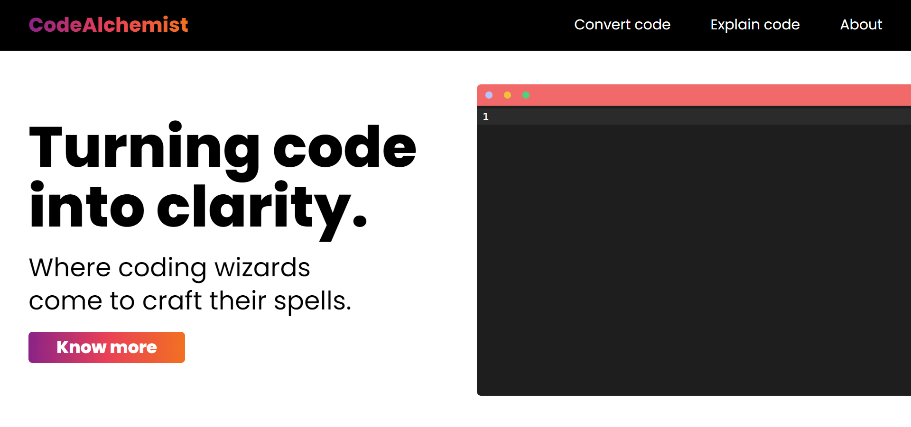

# Your code, no matter the language.

CodeAlchemist 2.0 is a revamp of the original [CodeAlchemist](https://github.com/Ryukemeister/CodeAlchemist) project. It is an online platform designed to help developers convert code from one language to another, quickly and accurately. Also with real-time code analysis, it can explain any given piece of code. Some major updates that CodeAlchemist 2.0 has is that it has been migrated to Next.js from Vite and now uses Google Bard along with OpenAI instead of just OpenAI. Also the previous OpenAI model "codex" has been migrated into gpt-3.5 turbo.

New features:

- Extend language options
- Option to convert regex code (in progress)

Upcoming features:

- Include option to convert language into code

## [Check it out !](https://codealchemist.vercel.app/)
